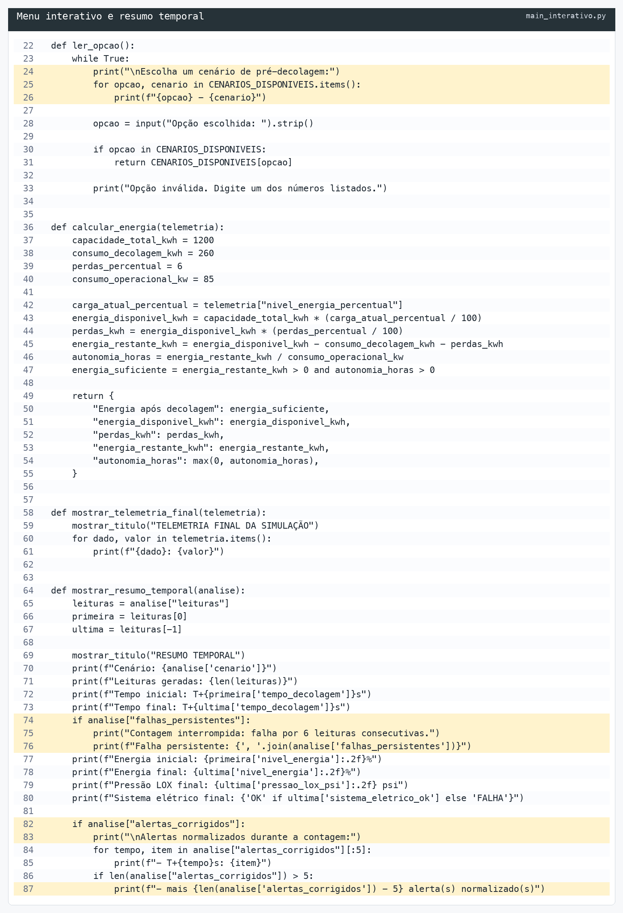
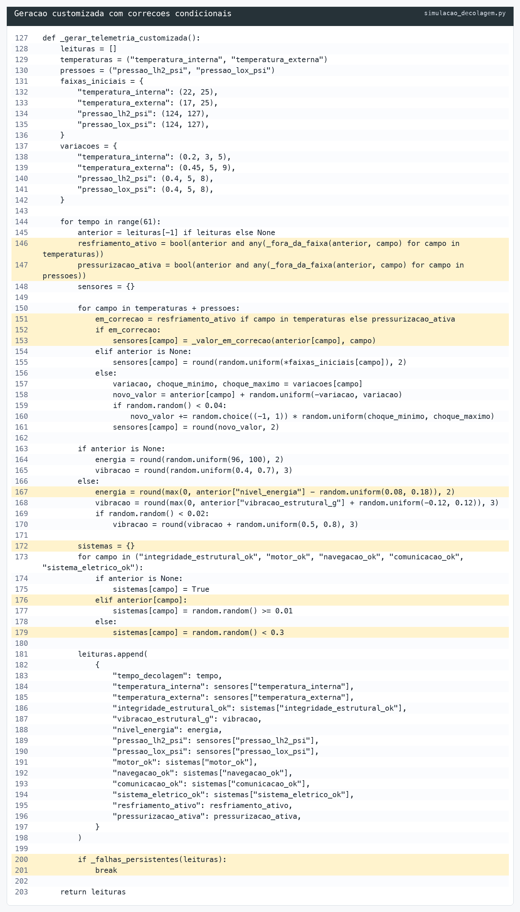
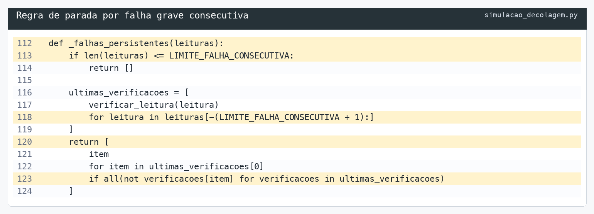
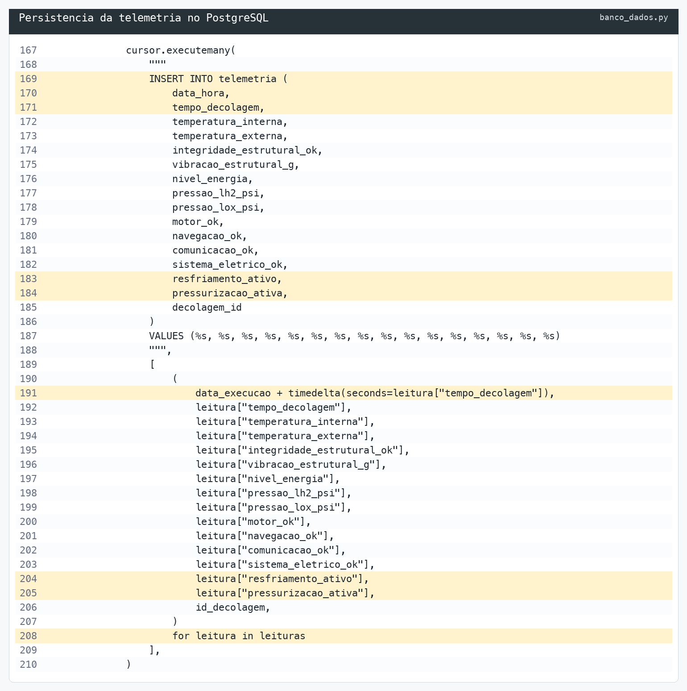
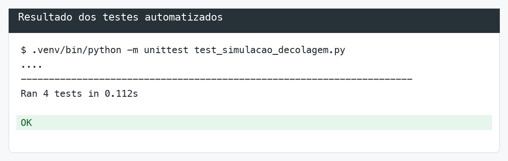

# Projeto Aurora Siger - Relatório Operacional de Pré-Decolagem

Este projeto faz parte da atividade integradora da Fase 1 do curso de Ciência da Computação.

O objetivo é simular uma verificação operacional de pré-decolagem da nave Aurora Siger, analisando dados de telemetria e decidindo se a nave está pronta para decolar ou se a decolagem deve ser abortada.

Repositório do projeto:

https://github.com/rdlach/fiap-fase1-projeto-aurora-siger

## O que o projeto analisa

- Temperatura interna e externa
- Integridade estrutural
- Nível de energia
- Vibração estrutural
- Pressão dos tanques de LH2 e LOX
- Status dos sistemas de motor, navegação, comunicação e sistema elétrico

## Dados simulados

| Cenário | Comportamento simulado | Resultado esperado |
| --- | --- | --- |
| `SUCESSO_DIRETO` | Todos os sistemas permanecem estáveis até `T+60s` | `PRONTO PARA DECOLAR` |
| `ERRO_CORRIGIDO` | A pressão de LOX cai durante a contagem, mas a pressurização corrige o problema | `PRONTO PARA DECOLAR` |
| `FALHA_CRITICA` | O sistema elétrico falha de forma persistente a partir de `T+35s`; a contagem para em `T+40s` | `DECOLAGEM ABORTADA` |
| `CUSTOMIZADO` | Sensores variam ao longo do tempo, com incidentes e correções condicionais | Depende dos dados gerados |

## Lógica da decisão

O sistema gera até 61 leituras de telemetria, simulando a contagem de `T+0s` até `T+60s`. Se qualquer verificação de segurança falhar por seis leituras consecutivas, a contagem para nessa sexta leitura e a decolagem é abortada. Falhas que voltam à faixa segura antes disso zeram a contagem consecutiva. Sem interrupção, a decisão usa a leitura de `T+60s`.

| Verificação | Faixa ou condição segura |
| --- | --- |
| Temperatura interna | Entre 18 °C e 27 °C |
| Temperatura externa | Entre 10 °C e 34 °C |
| Vibração estrutural | Entre 0 e 1,5 g RMS |
| Nível de energia | Maior ou igual a 80% |
| Pressão LH2 | Entre 120 e 130 psi |
| Pressão LOX | Entre 120 e 130 psi |
| Integridade estrutural | Igual a OK |
| Sistemas críticos | Motor, navegação, comunicação e sistema elétrico iguais a OK |

Depois das verificações básicas, o sistema calcula:

- energia disponível;
- perdas energéticas;
- energia restante após a decolagem;
- autonomia inicial estimada.

Se todas as condições forem atendidas e ainda houver energia suficiente após a decolagem, o resultado será:

```text
PRONTO PARA DECOLAR
```

Caso contrário, incluindo falha energética, o resultado será:

```text
DECOLAGEM ABORTADA
```

## Arquivos do projeto

- `nave-cod-siger.ipynb`: notebook principal com a simulação, verificações e análise energética.
- `aurora_siger.py`: versão em script Python para execução direta no PyCharm ou terminal.
- `main_interativo.py`: versão interativa em terminal, usando `input()` para escolher o cenário da nave.
- `simulacao_decolagem.py`: lógica dos cenários de pré-decolagem inspirada no modelo criado pelo José.
- `banco_dados.py`: funções responsáveis por conectar no PostgreSQL, criar as tabelas e salvar cada cenário.
- `consultar_execucoes.py`: consulta os últimos cenários salvos no banco.
- `requirements.txt`: dependência necessária para conectar o Python ao PostgreSQL.
- `sql/schema.sql`: script SQL com a estrutura das tabelas usadas no PostgreSQL.
- `sql/dados_exemplo.sql`: dados de exemplo para popular a tabela.
- `dump-aurora_siger-202609022050.sql`: dump usado como referência para o modelo de cenários e telemetria temporal.
- `prints/`: pasta reservada para prints da execução.
- `relatorio/relatorio_pre_decolagem.md`: texto-base do relatório final.
- `relatorio/`: pasta reservada para o PDF final da atividade.
- `AJUSTES_PENDENTES.md`: checklist do que ainda precisa ser revisado pelo grupo.

## Formas de demonstrar o projeto

O projeto pode ser mostrado de duas maneiras.

### 1. Tela interativa no terminal

Essa é a forma mais simples de apresentar a lógica funcionando ao vivo. O programa permite escolher um cenário de pré-decolagem e simula até 61 leituras de telemetria, de `T+0s` até `T+60s`.

Depois disso, ele mostra:

- a telemetria carregada;
- as verificações básicas;
- a análise energética;
- a decisão final.

Essa versão é boa para demonstrar o raciocínio do algoritmo passo a passo.

### 2. Tabela no notebook

O notebook também mostra cenários em formato de tabela, parecido com o exemplo usado em aula.

Nesse formato, cada linha representa uma situação da nave. A última coluna mostra a decisão:

- `PRONTO PARA DECOLAR`
- `DECOLAGEM ABORTADA`

Essa versão é boa para documentar o projeto e colocar no relatório.

Na prática, as duas formas se complementam:

- a tela interativa ajuda a apresentar o projeto funcionando;
- a tabela ajuda a deixar a análise organizada no notebook e no relatório.

Ou seja, não precisa escolher apenas uma. A tela mostra a simulação acontecendo e a tabela registra os cenários de forma clara.

## Evidências em prints

Os prints abaixo mostram os principais ajustes implementados no projeto: inclusão do cenário customizado, lógica temporal da telemetria, parada por falha persistente, persistência no PostgreSQL e testes automatizados.

### Menu com cenário customizado



### Geração customizada e correções condicionais



### Regra de parada por falha persistente



### Persistência da telemetria



### Testes automatizados



## Como executar

### Opção 1: Notebook

1. Abrir o arquivo `nave-cod-siger.ipynb` na sua IDE de preferência.
2. Selecionar um interpretador Python 3.
3. Executar as células na ordem em que aparecem.
4. Conferir o resultado final e a tabela de cenários simulados.

### Opção 2: Script Python

1. Abrir o arquivo `aurora_siger.py` no PyCharm.
2. Selecionar um interpretador Python 3.
3. Clicar com o botão direito no arquivo e escolher `Run 'aurora_siger'`.

Também é possível executar pelo terminal:

```bash
python3 aurora_siger.py
```

### Opção 3: Tela interativa no terminal

Esta versão usa os conceitos básicos vistos na fase: entrada de dados com `input()`, variáveis, conversão de tipos, operadores relacionais, `if/else` e impressão do resultado.

Ao iniciar, o programa permite escolher entre os cenários:

- `1 - SUCESSO_DIRETO`: todos os sistemas seguem dentro do comportamento esperado.
- `2 - ERRO_CORRIGIDO`: ocorre uma queda temporária na pressão de LOX, corrigida antes da decisão final.
- `3 - FALHA_CRITICA`: o sistema elétrico apresenta falha persistente e a decolagem é abortada.
- `4 - CUSTOMIZADO`: gera até 61 leituras com variações e incidentes aleatórios e executa as mesmas verificações, análise energética e gravação no PostgreSQL. Cada execução sorteia novos dados, sem preenchimento manual.

No cenário customizado, as temperaturas e pressões começam dentro das faixas seguras e variam gradualmente, com possibilidade de incidentes pontuais. A energia começa entre 96% e 100% e diminui ao longo da contagem; a vibração varia a partir da leitura anterior. Sistemas críticos podem falhar e voltar a funcionar em leituras posteriores, em vez de mudar de estado independentemente a cada segundo. Se uma temperatura ou pressão sair da faixa de segurança, a correção correspondente começa na leitura seguinte e o valor se aproxima da faixa segura enquanto o indicador estiver ativo. O indicador desliga após a leitura que voltou à faixa. Para as duas temperaturas, `resfriamento_ativo` representa a correção térmica, inclusive quando a temperatura está abaixo do mínimo.

No PyCharm:

1. Abrir o arquivo `main_interativo.py`.
2. Clicar com o botão direito no arquivo.
3. Escolher `Run 'main_interativo'`.
4. Digitar o número do cenário desejado, de 1 a 4, e pressionar ENTER.

Pelo terminal:

```bash
python3 main_interativo.py
```

### Histórico em banco PostgreSQL

Depois de cada execução do `aurora_siger.py` ou do `main_interativo.py`, o sistema tenta salvar automaticamente os dados em um banco PostgreSQL.

As tabelas são criadas sozinhas na primeira execução. O modelo segue a estrutura de simulação por cenário:

- `decolagem`: registra o cenário, o status final e o motivo de aborto quando houver.
- `telemetria`: registra as leituras associadas a cada decolagem.
- `parametros_seguranca`: registra os limites usados para validar os dados.

Esse banco guarda:

- data e hora simuladas de cada leitura e do fim da execução;
- nome do cenário;
- dados de telemetria;
- decisão final da missão.

Para instalar a dependência do PostgreSQL no Python:

```bash
pip install -r requirements.txt
```

Para criar o banco local pelo terminal do PostgreSQL:

```bash
createdb aurora_siger
```

No macOS com PostgreSQL instalado pelo Homebrew, também é possível usar:

```bash
brew services start postgresql@17
/opt/homebrew/opt/postgresql@17/bin/createdb -h localhost aurora_siger
```

Para criar a tabela manualmente:

```bash
psql -d aurora_siger -f sql/schema.sql
```

Para inserir dados de exemplo:

```bash
psql -d aurora_siger -f sql/dados_exemplo.sql
```

Para carregar o dump completo criado pelo José, use um banco vazio, porque o arquivo já traz a criação das tabelas e os dados:

```bash
psql -d aurora_siger -f dump-aurora_siger-202609022050.sql
```

O código usa estes dados de conexão como padrão:

| Configuração | Valor padrão |
| --- | --- |
| Host | `localhost` |
| Porta | `5432` |
| Banco | `aurora_siger` |
| Usuário | usuário atual do sistema |
| Senha | vazia |

Também é possível mudar esses valores por variáveis de ambiente:

```bash
export POSTGRES_HOST=localhost
export POSTGRES_PORT=5432
export POSTGRES_DB=aurora_siger
export POSTGRES_USER=postgres
export POSTGRES_PASSWORD=sua_senha
```

Para consultar as últimas execuções salvas:

```bash
python3 consultar_execucoes.py
```

Se o PostgreSQL não estiver configurado, o programa continua mostrando o resultado da missão e informa que não conseguiu salvar no banco.

## Prints da execução

Adicionar aqui os prints após executar o notebook:

- Print da telemetria inicial
- Print das verificações
- Print da decisão final
- Print da análise energética

Exemplo de inserção no README:

```markdown

```

## Resultado esperado

Com os dados simulados atualmente, o sistema deve retornar:

```text
PRONTO PARA DECOLAR
```

A energia disponível calculada é de 1044,00 kWh e a autonomia inicial estimada após decolagem é de aproximadamente 8,49 horas.

## Integrantes

- Ronei Davi Lach
- Gabriel Hampel Meireles
- Roberto Kenji Iuvata
- José Roberto Zendron
- David Silva
